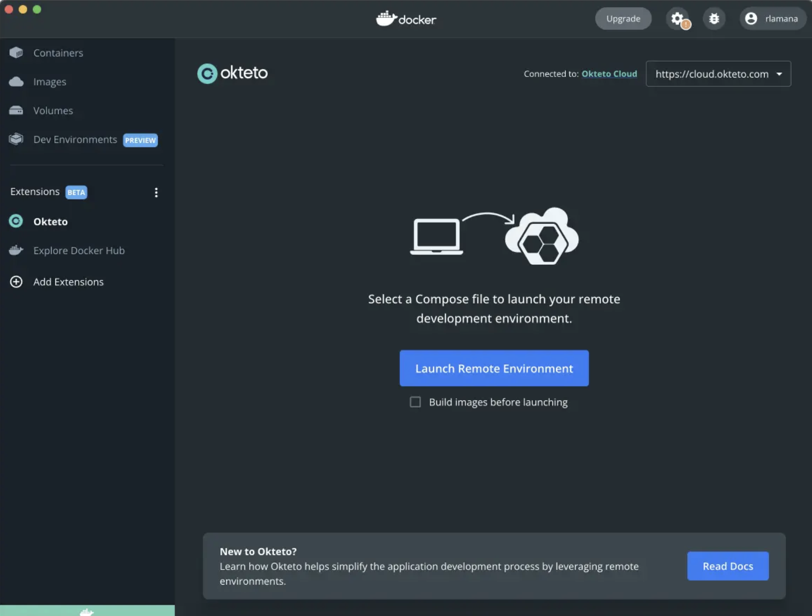

# Docker Extension for Okteto

A new development experience for applications running on Kubernetes.

## Overwiew

Do you love Docker Desktop, but your application is starting to get too big for your local machine? The Docker Extension for Okteto is exactly what you need. Get the Docker Desktop experience you love without the restrictions of having to run everything on your local machine.

## Try It Out Yourself!

Using the Docker Extension for Okteto is very simple. Once you have the extension installed, simply point it to the location of the Docker compose file or [Okteto Manifest](https://www.okteto.com/docs/reference/manifest/) describing your services and click the "Deploy Dev Environment" button! In a matter of minutes, all the services you require should be up and running in the cloud.

## Useful links

- [DockerCon Keynote Demo](https://www.youtube.com/watch?v=cq6Tpfji0vA&ab_channel=Okteto)
- [See our guide](CONTRIBUTING.md) on how to get started
